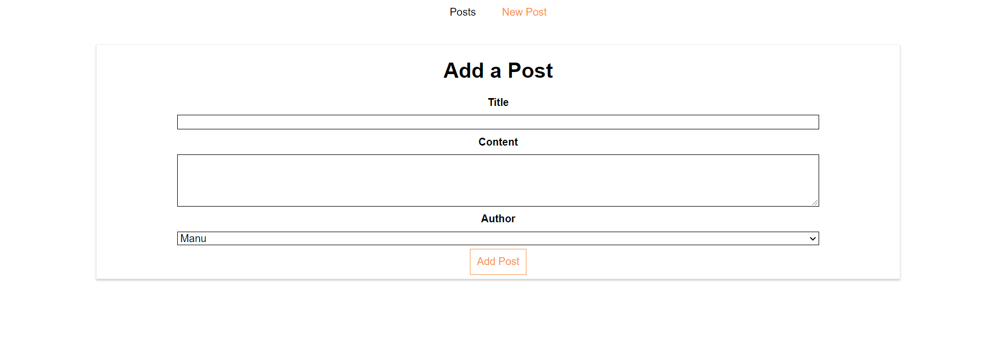

# React.js exercises CRUD

📝 This repository contains React exercises followed through Udemy course on topic ''React - The Complete Guide (incl Hooks, React Router, Redux)''

### Getting started

    git clone https://github.com/merima98/React.js-exercises-CRUD.git
    npm install
